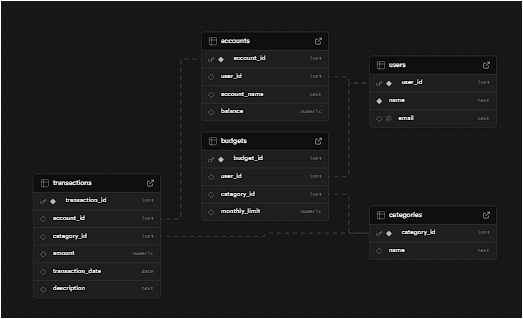

# Working
## Sample_data.py
This was created to populate the tables created that are referred in preplanning.md with fake or synthetic data.
Methodology:
These are just insertion functions to create the databases. One by one I have populated different tables, users, accounts, transactions, categories,budgets.
To reset data to start afresh, I had added a reset function to delete all the data.
## Main.py
I have started with loading the env variables first.
Then I have started by taking user input.
Then that user input is sent to a LLM with a system prompt which contains the schema_context.
The LLm then returns the SQL string in return
We then run the SQL query, if it failed we log error and inform the user. Else we send the results to another LLM with user prompt and then format the result.
If the user decides to exit then we exit.
### About functions
1. generate_sql(user_query)- 
   1. I tried initially substituting the context but I forgot to use the f string and it didn't work so I pasted it. That worked, so I didn't change it. Once the query is recieved it undergoes processing.
   2. The query recieved was in markdown format, so I looked up how do I remove that and the markdown block for sql goes like " \```sql abc \``` " . So i first stripped of the \```sql and then "```"
2. run_sql():
   1. so I created a function on my supabase backend which I will paste here:
       drop function run_sql(query text);
            create or replace function run_sql(query text)
            returns table(result jsonb)
            language plpgsql
            as $$
            begin
                return query execute format('select jsonb_agg(t) from (%s) t', query);
            end;
            $$;
    2.  So I used RPC- remote procedure call to run my function
    3.  then I am checking if the result object recieved has a data attribute in it and checks if it is empty or not.
    4.  Then it returns the list
3.  Format_result()- this is just converting the result into a NLP response.
4.  user_input()- here I take basic info from user and plug the user_id and call the other functions.


> You can check logs to see what outputs I got while testing
> Right now my database for some tables is smaller but that's because 1 user has many transactions. I can increase that from my sample data file.

Tables:


Data record counts:

Please ignore the chunks and uploaded files, those are from the main task.

These are some of the users if you wish to try this:
